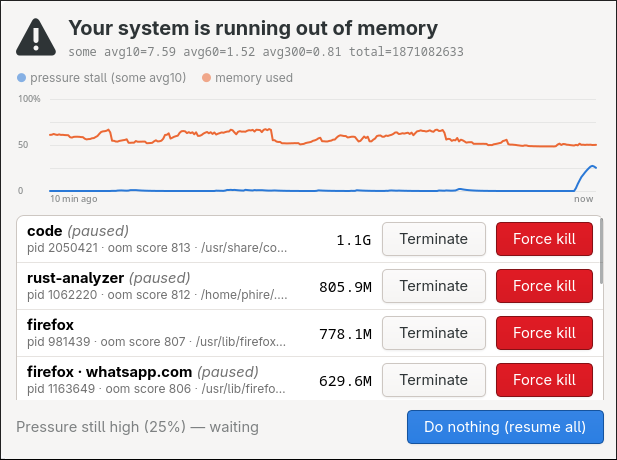

# psi-ask

An small standalone interactive userspace OOM handler for Linux, inspired by how macOS does it.



Instead of deciding to kill a program automatically, it **pauses** the top
candidates and asks how to handle it _early enough_.

The dialog shows a pressure/memory chart and the biggest memory
consumers. Each row has **Terminate** and
**Force kill**; "Do nothing" or Escape resumes everything, and a countdown
auto-dismisses (once pressure has actually dropped). Firefox's
anonymous processes are automatically resolved to their site.

## How it works

- Arms a kernel **PSI trigger** on `/proc/pressure/memory` and sleeps in
  `poll()` - zero CPU while idle. Debounces once.
  `--cgroup` additionally watches cgroup2 `memory.pressure` files; a cgroup
  event lists only that cgroup's processes.
- On pressure it SIGSTOPs the top offenders (excluding its own ancestor chain),
  shows the dialog, and SIGCONTs everything on every exit path.
- The binary memory locks itself, sets `oom_score_adj = -1000` and `nice -20`. This is done with `setcap` so the GUI does not have to run as root.
- You will lose around **14MB** of system memory since that is locked into this process (+30MB that is likely shared with other processes)

## Usage

```sh
./install.sh        # installs to ~/.local/bin + a systemd user service
                    # (setcap, MemoryMin=, no swap, starts with the session)
```

For a foreground run instead: `./install-caps.sh` once, then `./run.sh`.

## Options

```
--kind some|full      PSI line to trigger on            [some]
--stall-ms N          stall threshold within window     [500]
--window-s N          trigger window, multiple of 2     [2]
--cooldown-s N        quiet period after each prompt    [30]
--top N               candidates to list                [10]
--answer-timeout-s N  dialog timeout, 0 = wait forever  [60]
--chart-min N         minutes of history in the chart   [3]
--cgroup PATH         also watch this cgroup (repeatable)
--no-pause            don't SIGSTOP top offenders while asking
--window              normal movable window instead of overlay
```

`some` fires when any task stalls on memory; `full` only when all do.
Defaults are much earlier than systemd-oomd's because a human needs time to
answer.

## Low Effort Warning

Compared to some of my other projects this is a low-effort project, with the goal of "works for me". The code is made with AI help. It's pretty hard to test this kind of thing because real memory pressure is hard to emulate, so I don't know if it works for all situations. It only supports Wayland right now.

Pressure stall information is pretty guaranteed to be the right trigger because it simply checks how much CPU usage is being spent waiting for memory pages to be moved in and out of RAM. But it might be set too sensitive in the default.

The pausing of processes is not guaranteed to make the system responsive because the thrashing can theoretically come from any selection of processes, not just the highest memory consumers.


## Prior art

- [systemd-oomd](https://man.archlinux.org/man/systemd-oomd.8): automatic cgroup killer using PSI. **You will want this enabled regardless**
- [psi-notify](https://github.com/cdown/psi-notify): unprivileged PSI notifier
- [kernel PSI docs](https://docs.kernel.org/accounting/psi.html)
- macOS's out-of-application-memory dialog — the pause-then-ask UX
